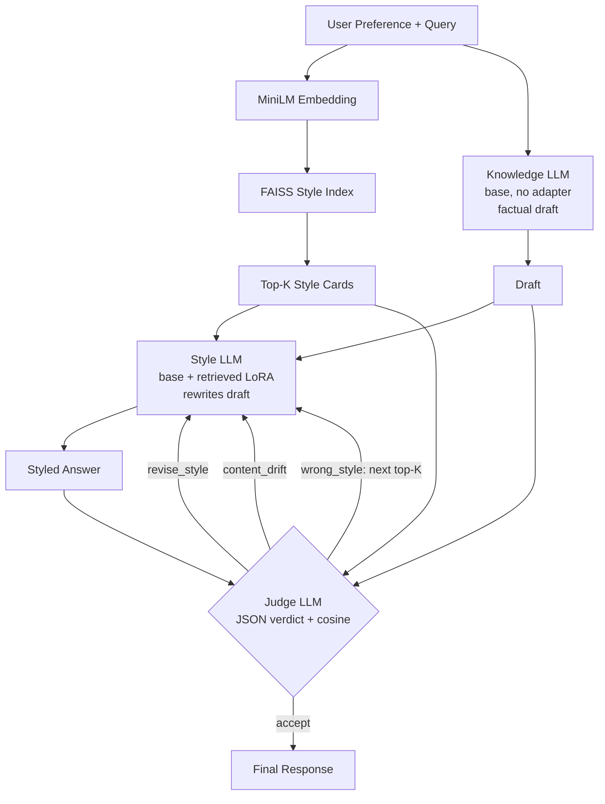

# Zero-Shot Alignment via Retrieval

Align LLM outputs to user preferences by retrieving pre-trained style modules (LoRA adapters) at inference time, instead of fine-tuning per user. Given a natural language preference description (e.g., "be formal and academic"), the system retrieves the best-matching style adapter from a bank of pre-trained modules and composes it onto a base LLM to generate preference-aligned responses.

## Why not just fine-tune? And if it's "zero-shot," why is there a training step?

The term "zero-shot" here refers to what happens at inference time from the user's perspective. A new user shows up, describes what they want in plain English, and gets a styled response immediately. No fine-tuning, no data collection, no waiting. That part is zero-shot.

But the adapter bank itself has to exist first. We train a set of LoRA adapters offline, once, each one capturing a different writing style. Think of it like stocking a library: you write the books ahead of time so that readers can just walk in and pick one off the shelf. The training is a one-time cost to build the shelf. The retrieval is what makes it zero-shot for every user after that.

This matters because the alternative (fine-tuning a model per user) is expensive, slow, and doesn't scale. With retrieval, adding a new style just means training one more adapter and dropping it into the bank. Existing users aren't affected and no retraining of the full model is needed.

| Step | What happens | Runs when |
|---|---|---|
| Adapter training | Train 10 LoRA modules on curated style datasets | Once, offline |
| Index building | Embed style descriptions into FAISS index | Once, offline |
| Retrieval + generation | User query → nearest style → compose adapter → generate | Every request, zero-shot |

## Architecture

```
User Preference Query ──► Embedding Model ──► FAISS Index ──► Top-K Style Cards
        │                  (MiniLM-L6-v2)      (cosine sim)         │
        │                                                           │
        ▼                                                           ▼
   User Prompt ──────────────────────────────► Base LLM + LoRA ──► Styled Response
                                               (TinyLlama 1.1B)
```

### Components

| Component | Implementation | Purpose |
|---|---|---|
| Style Representation | Style Cards (JSONL) | Searchable descriptions with tags, instructions, and examples |
| Retrieval | Sentence embeddings + FAISS | Fast nearest-neighbor search over style descriptions |
| Adaptation | LoRA adapters (PEFT) | Lightweight style modules composed onto base model |
| Evaluation | Heuristic + LLM-as-judge scoring | Measures retrieval accuracy, style adherence, and win rates |

## 3-LLM Architecture (Knowledge / Style / Judge)

The 3-LLM pipeline in `judge/` decomposes the single-model path into three role-specialized LLMs plus a feedback loop, so generation, stylization, and quality gating no longer compete inside one model.



| Role | Model (via Ollama) | Input | Output |
|---|---|---|---|
| Knowledge LLM | `llama3.1:8b-instruct-q4_K_M` | User query | Neutral factual draft |
| Style LLM | `llama3.1:8b-instruct-q4_K_M` + retrieved **Style Card** in prompt | Draft + style card + preference | Rewritten answer in target style |
| Judge LLM | `mistral:7b-instruct-q4_K_M` (different family → reduces self-preference bias) | Draft + styled + style card | `JudgeVerdict(style_score, content_faithful, content_cosine, action, rationale)` |

Models are configurable in `judge/config.py`. Embedding-based retrieval and the judge's content-preservation cosine still run locally with `sentence-transformers/all-MiniLM-L6-v2`.

> **Note on the Style role.** The existing LoRA adapters in `style_bank/adapters/` were trained on TinyLlama 1.1B and do not transfer to Llama 3.1 8B. The current Ollama pipeline therefore runs Style in **prompt mode**: FAISS still retrieves the best Style Card (instruction + few-shot examples) and injects it into the prompt. Restoring the LoRA-retrieval path requires retraining adapters on the new base model and converting them to GGUF for Ollama's `ADAPTER` directive — tracked in `TODO.md`.

The orchestrator caps the loop at `MAX_REVISIONS=2`, tracks a best-so-far candidate, and always emits something. Content preservation is measured with cosine similarity between sentence embeddings of the draft and the styled answer, independent of the judge's LLM call, to catch hallucinations that the judge might miss. All intermediate steps (every attempt, every verdict) are persisted to `results/traces/`.

See `TODO.md` for the full rollout plan, research references (ZeroStylus 2025, CollabEval 2025, MAJ-EVAL 2025, LoRAHub, Self-RAG), and success criteria.

## Two pipelines in this repo

The project now ships two pipelines side by side that share the same style bank, FAISS index, and LoRA adapters:

| Pipeline | Location | What it is |
|---|---|---|
| **Single-LLM (baseline)** | `previous/` | Original pipeline: retrieve style → base model + LoRA → response |
| **3-LLM (Knowledge / Style / Judge)** | `judge/` | Decouples roles: a Knowledge LLM drafts factual content, a Style LLM rewrites it with the retrieved LoRA, and a Judge LLM evaluates and drives a bounded revision loop |

The 3-LLM pipeline is motivated by the weak style-transfer results of the baseline (win rate 4/20 on TinyLlama 1.1B) and by recent multi-agent-as-judge work (CollabEval 2025, MAJ-EVAL 2025) and content/style decoupling (ZeroStylus 2025). See `TODO.md` for the full plan and mermaid flow.

## Project Structure

```
├── previous/                    # Single-LLM pipeline (baseline)
│   ├── run_pipeline.py          #   entry point: --step {index,train,evaluate,demo}
│   └── src/
│       ├── config.py            #   shared config (paths point to repo root)
│       ├── build_index.py       #   builds FAISS index from style cards
│       ├── retrieve.py          #   top-k style retrieval
│       ├── train_adapters.py    #   trains LoRA adapters (one per style)
│       ├── generate.py          #   base + LoRA generation
│       └── evaluate.py          #   retrieval accuracy, adherence, win rates
│
├── judge/                       # 3-LLM pipeline (Knowledge / Style / Judge)
│   ├── run_pipeline.py          #   entry point: --step {evaluate,demo}
│   ├── config.py                #   shared config + orchestrator thresholds
│   ├── retrieve.py              #   style retrieval (+ .embed() for the judge)
│   ├── eval_data.py             #   eval set + heuristic scorer
│   ├── evaluate.py              #   3-LLM eval, writes results + traces
│   └── agents/
│       ├── schemas.py           #   JudgeVerdict, RevisionStep, PipelineTrace
│       ├── shared_model.py      #   one loaded base model shared across all 3 roles
│       ├── knowledge.py         #   Knowledge LLM (no adapter, neutral draft)
│       ├── style.py             #   Style LLM (base + retrieved LoRA, rewrites the draft)
│       ├── judge.py             #   Judge LLM (JSON verdict + embedding cosine)
│       └── orchestrator.py      #   accept / revise_style / content_drift / wrong_style loop
│
├── style_bank/                  # Shared by both pipelines
│   ├── style_cards.jsonl        #   10 style definitions with examples
│   └── adapters/                #   Trained LoRA weights
├── data/
│   ├── training/                #   Curated JSONL datasets (20 examples per style)
│   └── ...                      #   FAISS index and metadata
├── results/                     # Evaluation results and per-request judge traces
├── TODO.md                      # 3-LLM architecture plan with mermaid diagrams
└── requirements.txt
```

## Setup

### Requirements

- Python 3.10+
- macOS with Apple Silicon (MPS) or a CUDA GPU
- ~8 GB RAM minimum

### Installation

```bash
git clone https://github.com/sumonesphantom/KRR-Zero-Shot-Alignment-via-Retrieval.git
cd KRR-Zero-Shot-Alignment-via-Retrieval
pip install -r requirements.txt
```

## Usage

The 3-LLM pipeline reuses the FAISS index and LoRA adapters built by the single-LLM pipeline, so run the baseline's `index` + `train` steps first.

### 1. Build shared artifacts (index + adapters)

```bash
# Build the FAISS retrieval index from style cards
python previous/run_pipeline.py --step index

# Train LoRA adapters for all 10 styles
python previous/run_pipeline.py --step train
```

### 2a. Single-LLM baseline (retrieve → base + LoRA → respond)

```bash
# End-to-end
python previous/run_pipeline.py --step all

# Evaluation only
python previous/run_pipeline.py --step evaluate
python previous/run_pipeline.py --step evaluate --llm-judge   # adds LLM-as-judge scoring

# Interactive demo
python previous/run_pipeline.py --step demo
```

### 2b. 3-LLM pipeline (Knowledge / Style / Judge) via Ollama

Pull the models once:

```bash
ollama pull llama3.1:8b-instruct-q4_K_M   # Knowledge + Style
ollama pull mistral:7b-instruct-q4_K_M    # Judge
```

Make sure `ollama serve` is running, then:

```bash
# 3-LLM evaluation (same 20-prompt set as the baseline)
python judge/run_pipeline.py --step evaluate

# Interactive demo — shows draft, each style attempt, and each judge verdict
python judge/run_pipeline.py --step demo
```

Per-role models are set in `judge/config.py` (`KNOWLEDGE_MODEL`, `STYLE_MODEL`, `JUDGE_MODEL`, `OLLAMA_HOST`).

Outputs:
- `results/evaluation_results.json` — baseline (single-LLM) report
- `results/evaluation_results_3llm.json` — 3-LLM summary (content cosine, revision count, judge style score, win rate vs base)
- `results/traces/trace_NN.json` — full per-request trace: retrieval, draft, every style attempt, every judge verdict

### Interactive Demo (single-LLM)

```
Your preference: explain things simply with fun analogies
Your question: How does Wi-Fi work?

Retrieving best style...
Top matches:
  #1 eli5_simple (score: 0.8234)
  #2 casual_friendly (score: 0.7102)
  #3 storytelling_narrative (score: 0.6543)

Generating with style: eli5_simple...

--- Response (eli5_simple) ---
Imagine your phone is sending invisible letters through the air...
```

## Implementation Details

### 1. Style Representation (Style Cards)

Each style is defined as a Style Card in `style_bank/style_cards.jsonl`:

```json
{
  "id": "formal_academic",
  "tags": ["formal", "academic", "detailed", "structured"],
  "instruction": "Answer in a formal academic tone. Use precise terminology...",
  "examples": [
    {
      "prompt": "Explain gradient descent.",
      "answer": "Gradient descent is a first-order iterative optimization..."
    }
  ],
  "adapter_path": "style_bank/adapters/formal_academic"
}
```

The 10 styles:

| Style | Tags | Description |
|---|---|---|
| `formal_academic` | formal, academic, detailed | Precise terminology, structured paragraphs |
| `casual_friendly` | casual, friendly, warm | Conversational, contractions, light humor |
| `concise_bullet` | concise, bullet points, minimal | Key facts only, no fluff |
| `eli5_simple` | simple, eli5, analogies | Explain like I'm 5, fun analogies |
| `technical_precise` | technical, precise, code-oriented | Specific details, formulas, numbers |
| `socratic_teaching` | socratic, teaching, questions | Guide understanding through questions |
| `storytelling_narrative` | storytelling, creative, engaging | Weave explanations into narratives |
| `professional_business` | professional, executive, actionable | ROI focus, strategic relevance |
| `empathetic_supportive` | empathetic, encouraging, patient | Warm, validating, gentle explanations |
| `debate_critical` | critical, analytical, balanced | Multiple perspectives, pros and cons |

### 2. Training Data

Each style has a curated JSONL dataset in `data/training/` with ~20 prompt-response pairs. The prompts include an explicit style tag (e.g., `Style: Formal Academic`) to anchor the LoRA to the right behavior and prevent style bleed. Topics are diverse — science, economics, technology, everyday tasks — so the adapter learns the style itself rather than memorizing subject-specific patterns.

The training code loads curated data first. If no curated file is found for a given style, it falls back to synthetic data generation using the base model.

### 3. Style Embedding and Retrieval

**Indexing** (`src/build_index.py`):
- Builds a text representation for each style card by combining its instruction, tags, and example Q&A pairs
- Encodes with `sentence-transformers/all-MiniLM-L6-v2` (384-dim embeddings)
- Stores normalized embeddings in a FAISS `IndexFlatIP` index (inner product = cosine similarity on normalized vectors)

**Retrieval** (`src/retrieve.py`):
- Encodes the user's preference query with the same embedding model
- Performs FAISS nearest-neighbor search to find top-k matching styles
- Computes softmax weights over similarity scores (with temperature scaling) for potential weighted composition

```python
retriever = StyleRetriever()
results = retriever.retrieve("I want formal academic explanations", top_k=3)
# Returns: [(style_card, similarity_score, weight), ...]
```

### 4. LoRA Adapter Training

**Training** (`src/train_adapters.py`):
- Loads curated training data from `data/training/{style_id}.jsonl` (20 prompt-response pairs per style)
- Trains a LoRA adapter (rank=16, alpha=32) on the `q_proj`, `v_proj`, `k_proj`, `o_proj` attention layers
- Each adapter adds only ~4M trainable parameters vs 1.1B total — lightweight and composable

**LoRA Configuration:**
| Parameter | Value |
|---|---|
| Rank (r) | 16 |
| Alpha | 32 |
| Dropout | 0.05 |
| Target Modules | q_proj, v_proj, k_proj, o_proj |
| Training Epochs | 3 |
| Learning Rate | 2e-4 |

### 5. Generation with Composed Adapters

**Generation** (`src/generate.py`):
- Loads the base model (TinyLlama 1.1B Chat) once
- For each request, loads the retrieved LoRA adapter on top
- Generates with the composed model (base + adapter)
- Supports comparison mode: generates base, retrieved-style, and random-style outputs for the same prompt

### 6. Evaluation

**Evaluation** (`src/evaluate.py`) measures three things:

#### a) Retrieval Accuracy
- Tests whether the retriever returns the correct style for 20 diverse preference queries
- Reports top-1 accuracy (exact match) and top-3 accuracy (correct style in top 3)

#### b) Style Adherence Scoring
Two scoring methods:

- Keyword heuristics: rule-based scoring per style (e.g., checking for bullet points in `concise_bullet`, question marks in `socratic_teaching`, formal vocabulary in `formal_academic`)
- LLM-as-judge (optional): uses the base model to rate style adherence on a 1-5 scale

#### c) Pairwise Win Rates
Compares outputs across three conditions:
- Retrieved adapter vs base model (no adapter)
- Retrieved adapter vs random adapter (wrong style)
- Random adapter vs base model

The retrieved adapter should win against both the base model and a random adapter.

#### Baselines

| Baseline | Description |
|---|---|
| Base model | TinyLlama 1.1B with no adapter applied |
| Random adapter | A randomly selected (wrong) style adapter |
| Retrieved adapter | Our method — style selected by retrieval |

## Configuration

All configurable parameters are in `src/config.py`:

```python
# Model
BASE_MODEL_NAME = "TinyLlama/TinyLlama-1.1B-Chat-v1.0"
EMBEDDING_MODEL_NAME = "sentence-transformers/all-MiniLM-L6-v2"

# LoRA
LORA_R = 16
LORA_ALPHA = 32
LORA_DROPOUT = 0.05
TRAIN_EPOCHS = 3
LEARNING_RATE = 2e-4

# Retrieval
TOP_K = 5
TEMPERATURE = 0.1

# Generation
MAX_NEW_TOKENS = 256
```

To use a larger base model (e.g., Llama 3.1 8B, Mistral 7B), change `BASE_MODEL_NAME` and ensure you have sufficient VRAM/RAM.

## Preliminary Results

Results from our initial evaluation run using TinyLlama 1.1B as the base model, with 10 trained LoRA adapters evaluated across 20 test prompts.

### Retrieval Accuracy

| Metric | Score |
|--------|-------|
| Top-1 Accuracy | 0.75 |
| Top-3 Accuracy | 0.90 |

The retrieval component performs well: in 75% of cases the correct style is ranked first, and in 90% of cases it appears within the top 3. This validates the sentence-embedding + FAISS approach for mapping free-form user preferences to discrete style categories.

### Style Adherence

Mean heuristic-based style adherence scores across all 20 test prompts:

| Condition | Mean Score |
|-----------|-----------|
| Base model (no adapter) | 0.328 |
| Retrieved adapter | 0.345 |
| Random adapter | 0.336 |

The retrieved adapter shows a marginal improvement over both baselines. The small delta suggests that while the adapters do shift model behavior, the effect is limited — likely due to the constrained capacity of TinyLlama 1.1B and the small training set size (20 examples per style).

### Pairwise Win Rates

Win counts out of 20 evaluation pairs:

| Comparison | Wins |
|------------|------|
| Retrieved vs Base | 4/20 |
| Retrieved vs Random | 4/20 |
| Random vs Base | 3/20 |

#### Per-Style Breakdown

| Style | Retrieved vs Base | Retrieved vs Random |
|-------|:-----------------:|:-------------------:|
| casual_friendly | 2/2 | 1/2 |
| professional_business | 1/2 | 1/2 |
| debate_critical | 1/2 | 1/2 |
| formal_academic | 0/2 | 0/2 |
| concise_bullet | 0/2 | 0/2 |
| eli5_simple | 0/2 | 0/2 |
| technical_precise | 0/2 | 1/2 |
| socratic_teaching | 0/2 | 0/2 |
| storytelling_narrative | 0/2 | 0/2 |
| empathetic_supportive | 0/2 | 0/2 |

### Analysis

Several observations from this initial evaluation:

1. **Retrieval works, adaptation is the bottleneck.** The FAISS-based retrieval achieves strong accuracy (75%/90%), but the downstream style transfer effect is weak. This is consistent with prior work showing that small base models have limited capacity to express stylistic variation through LoRA alone.

2. **Style-dependent performance.** Styles with more surface-level lexical markers (e.g., `casual_friendly` with contractions, `professional_business` with structured formatting) show clearer wins. Styles requiring deeper structural changes (e.g., `socratic_teaching` requiring question generation, `storytelling_narrative` requiring narrative framing) show no measurable improvement, likely because TinyLlama lacks the capacity for these transformations.

3. **Heuristic scoring limitations.** The current evaluation relies on keyword-based heuristics (e.g., checking for bullet points, question marks, formal vocabulary). These proxies are coarse — for instance, `formal_words` scores 0.0 across all conditions because the heuristic looks for a narrow set of academic terms. A more robust evaluation (e.g., LLM-as-judge with a larger model) would better capture stylistic nuance.

4. **Generation quality issues.** Some outputs exhibit degenerate behavior (e.g., repeating tokens), suggesting that generation hyperparameters or adapter training may need further tuning.

### Next Steps

- Scale to a larger base model (e.g., Llama 3.1 8B or Mistral 7B) to test whether increased model capacity improves style transfer
- Expand training data beyond 20 examples per style
- Implement LLM-as-judge evaluation with a stronger evaluator model
- Explore weighted adapter composition for blended styles

Raw evaluation data is saved to `results/evaluation_results.json`.

## Design Decisions

**Why retrieval instead of per-user fine-tuning?**
Fine-tuning a model for every new user is expensive and doesn't scale. With retrieval, you build the adapter bank once and every new user gets instant style matching. Adding a new style means training one small adapter, not touching the base model.

**Why LoRA?**
LoRA adapters are small (~16 MB each vs 4 GB for the full model), fast to train, and can be swapped at inference time without reloading the base model. This makes the retrieval-and-compose pattern practical.

**Why curated training data?**
We use small, hand-written datasets (20 examples per style) rather than large scraped corpora. This gives direct control over what each style looks like and avoids noise. The datasets are small enough that training is fast but targeted enough that the adapters learn clear style differences.

**Why FAISS?**
FAISS provides sub-millisecond nearest-neighbor search, making retrieval negligible compared to generation time.

## References

- [LoRA: Low-Rank Adaptation of Large Language Models](https://arxiv.org/abs/2106.09685) (Hu et al., 2021)
- [PEFT: Parameter-Efficient Fine-Tuning](https://github.com/huggingface/peft)
- [Sentence-Transformers](https://www.sbert.net/)
- [FAISS: A Library for Efficient Similarity Search](https://github.com/facebookresearch/faiss)
